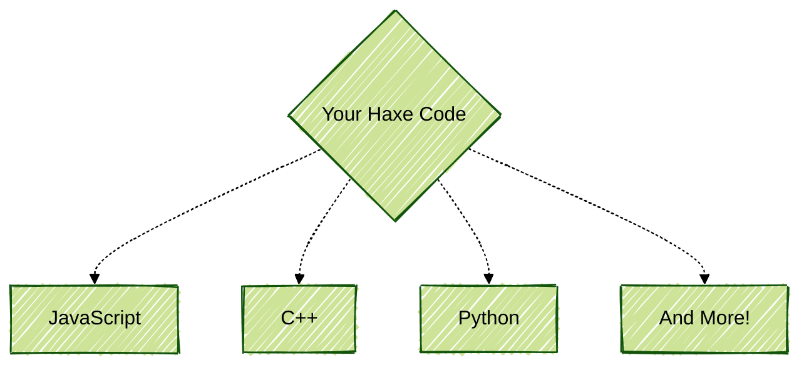

Like any good book, we have a ensemble of reoccurring characters that you will become intimately familiar as you commence through. Let me introduce them to you!
## The Program
You are likely very familiar with some programs: your web browser, the calculator app on your phone, etc. While they might seem simple, all of these programs you are used to are built upon immense feats of engineering. A program can also be something simple, like adding two numbers together or putting text on your screen.

In the most fundamental sense, a *program* is anything that gets ran by our CPU (Central Processing Unit). This is the shiny chip in your laptop, desktop, or phone that does the actual *computing*. In order to tell the CPU what to do, we give it a series of on and off signals called *machine code*. For human comprehension, we write $1$ for on and $0$ for off. You might recognize these as binary.

On Intel/AMD systems, a small program that adds $2$ and $3$ together written in machine code would look like this:
```js
10111000 00000010 00000000 00000000 00000000
10111011 00000011 00000000 00000000 00000000
00000001 11011000
```
As I for one do not understand this program, it seems unfathomable to write like this from scratch. Most programmers today see machine code as complete gibberish; yet, for much of early computing history this was simply the norm.
## The Programming Language
To make things simpler for ourselves, programmers created *programming languages* that convert human-readable code into machine code with a process called *compiling*. The earliest languages, called *assemblers*, closely resembled the form of machine code, however shortly after more advanced languages like FORTRAN were designed in the late 50s to simplify our lives even further.

Here is a similar program to what we wrote above but written in modern FORTRAN. Don't worry if it doesn't make sense, we aren't going to be learning FORTRAN anyways, but notice how much more readable it is at a first glance:
```fortran
program add_numbers
  print *, 2 + 3
end program add_numbers
```
If you try reading it out loud, you should notice how it closely resembles English. This simplicity was a breath of fresh air to programmers who previously wrote complex machine code. This program would be fed into a FORTRAN *compiler* (of which many existed) which then outputted machine code.

FORTRAN is still in use today, albeit only for niche applications. Some other programming languages you will encounter are 
C, C++, Python, Java, JavaScript, and PHP. While all of the languages listed can be used for any purpose, they all have specific tasks that they excel at. For instance, JavaScript is most popular on the web and Python is popular with those working in data science or artificial intelligence. Haxe is also a programming language, but instead of compiling straight to machine code, it converts itself to other programming languages.

This ability lets you utilize the features and ecosystems of the different languages that you are converting to. Haxe can also run your code directly, skipping compilation, using something called an *interpreter*. We will be using this while playing with our first few Haxe programs.
## The Text Editor
Early computers used physical switches and punched cards in order to program them, nowadays we use text editors. While you very easily could use something like Notepad (Windows) or TextEdit (macOS) to write code, there are special editors that add features like highlighting and autocomplete intended for programming.

Some popular choices include:
- VSCode
- Vim/Neovim
- Emacs
- Sublime Text
- Zed
- Jetbrains Intellij

Many developers are so attached to their editor of choice that there is a [rivalry](https://en.wikipedia.org/wiki/Editor_war) between users of different editors. To keep things simple, we will be using Visual Studio Code (VSCode) as it is the most popular editor in use by Haxe developers. It is created by Microsoft and other open source contributors, and works on Windows, Linux, and macOS. Knowledge in one editor will usually translate over easily. We will go through the installation process of VSCode together shortly.
## Haxe
This is the star of the show! We already touched on it compilation prowess, but it has a few other tricks up its sleeve including its advanced macro system and functional programming capabilities.

Haxe was originally written by Motion Twin developer Nicolas Cannasse. Many of Motion Twin's games were originally written in the now defunct programming language ActionScript, which was slow to develop games with and lacking in some features. Haxe shares many similarities with ActionScript, but is a completely unique language. Unlike languages like FORTRAN or C++, Haxe only has one compiler: Haxe.

Our simple $2+3$ program written in Haxe looks like this:
```haxe
class Main {
	static function main() {
		trace(2 + 3);
	}
}
```
Just from this short example, you will see utilization of classes and functions, both of which should feel natural in a short time.